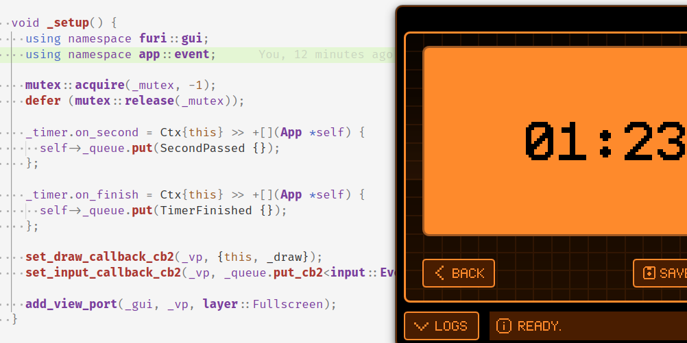
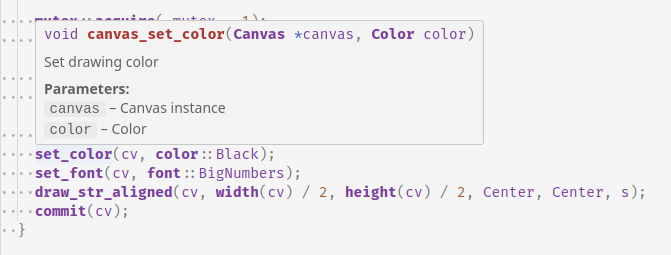

Мой [Флиппер] дошел до меня больше полугода назад, но что-то под него написать я собрался только сейчас. Его API рассчитаны на язык С — а у меня с ним опыта не очень много. Но проблем с тулингом не возникло — у Флиппера есть своя [система сборки], которая скачала мне нужный тулчейн и сгенерировала настройки для IDE.

[Флиппер]: https://flipperzero.one/
[система сборки]: https://github.com/flipperdevices/flipperzero-firmware/blob/dev/documentation/fbt.md

А для написания кода я решил использовать все же не C, а C++ — точнее, даже "Си-с-классами". На мой взгляд, затуманенный языками более высокого уровня, такой подход получился удобнее, чем писать на чистом C. Результат можно увидеть [в моем репозитории], а в этой статье я попытаюсь описать, какие конкретные фичи языка я использовал, и как именно они мне помогли.

[в моем репозитории]: https://github.com/iliazeus/furi-cpp



Сразу скажу, что моей целью не было написание полноценных C++-биндингов для API флиппера. Конечно же, обернув функции здешнего API в классы, используя конструкторы и деструкторы вместо `_alloc()`- и `_free()`-функций, а некоторые интерфейсы переписав совсем, я смог бы писать намного более идиоматичный код с точки зрения современного C++. Однако это потребовало бы намного больших затрат времени на написание, документацию и поддержку. Вместо этого, я искал от C++ способы как можно более простым способом избавиться от самых больших неудобств — некоторыми из которых и хочу с вами поделиться.

## Пространства имен

В сишных API функции и константы, как правило, называются с длинными префиксами: `mylib_mything_get_foo()`, `MylibMyenumFirst`. Порой это делает код чрезвычайно многословным — особенно в тех случаях, когда из контекста функции вполне понятно, что `get_foo()` мы вызываем именно для `mything` из библиотеки `mylib`. Поэтому, прежде всего, я хотел раскидать имена по отдельным пространствам имен.

Для типов это можно сделать, просто добавив типы-аласы. Вроде таких:

```cpp
namespace furi {
  using Timer = ::FuriTimer;
  using Mutex = ::FuriMutex;
}
```

Для функций все чуть более интересно:

```cpp
namespace furi::mutex {
  constexpr inline auto& acquire = ::furi_mutex_acquire;
}
```

Подход с ссылками имеет сразу несколько плюсов. Во-первых, `constexpr`-ссылки гарантированно хорошо инлайнятся, превращаясь просто в вызовы оригиналов — в моих тестах у меня не было не-встроенных вызовов. Во-вторых, это - в отличие, например, от написания оберток — не требует повторять сигнатуру исходной функции. Более того, моя IDE даже подтянула для таких ссылок документацию оригиналов:



Для того, чтобы не писать в каждой строчке `constexpr inline auto&`, я определил для этого макрос `FURI_HH_ALIAS`. Для макросов в C++, к сожалению, пространств имен нет, поэтому его пришлось назвать с префиксом.

Остались только `enum`ы. Идиоматичным C++ было бы использовать для них `enum class` — но проблема в том, что это будут другие типы, и один в другой сами по себе конвертироваться не будут. Поэтому остановился на алиасах и константах в отдельном `namespace`, для которых использовал все тот же макрос `FURI_HH_ALIAS`:

```cpp
namespace furi::mutex {
  using Type = ::FuriMutexType;
  namespace type {
    FURI_HH_ALIAS Normal = ::FuriMutexTypeNormal;
    FURI_HH_ALIAS Recursive = ::FuriMutexTypeRecursive;
  }
}
```

В итоге, мои заголовочные файлы стали выглядеть как-то так:

<details>
<summary>mutex.hh</summary>

```cpp
#pragma once

#include <furi.h>

#include "furi/macros.hh"
#include "furi/own.hh"

namespace furi {
  using Mutex = ::FuriMutex;
  using MutexOwn = Own<::FuriMutex, ::furi_mutex_free>;

  namespace mutex {
    using Type = ::FuriMutexType;
    namespace type {
      FURI_HH_ALIAS Normal = ::FuriMutexTypeNormal;
      FURI_HH_ALIAS Recursive = ::FuriMutexTypeRecursive;
    }

    FURI_HH_ALIAS alloc = ::furi_mutex_alloc;
    FURI_HH_ALIAS free = ::furi_mutex_free;
    FURI_HH_ALIAS acquire = ::furi_mutex_acquire;
    FURI_HH_ALIAS release = ::furi_mutex_release;
    FURI_HH_ALIAS get_owner = ::furi_mutex_get_owner;
  }
}
```

</details>

## Владеющие указатели

Следующее неудобство, от которого я хотел бы избавиться — необходимость не забывать вручную освобождать ресурсы. Возможно, я просто слишком привык к языкам, в которых есть `using`, деструкторы или хотя бы `try-finally`, но мне действительно бывает сложно следить за этим самому. Особенно в случае ранних возвратов из функций, или передачи владения указателем.

Стандартный "владеющий" указатель в C++ — это `std::unique_ptr`. Но он мне не подошел по нескольким причинам.

Первая довольно прозаична: `std::unique_ptr<T>` не конвертируется автоматически в `T*`, для этого нужно явно вызывать метод `.get()`. В API Флиппера владение указателем, как правило, в функцию не передается — исключая `_free()`-функции, конечно. А писать везде `.get()` получается слишком многословно.

Другая проблема немного сложнее, и связана с тем, как именно устроены API Флиппера и логика.

У `std::unique_ptr` есть возможность указать вторым параметром шаблона объект `Deleter`, который [будет отвечать] за то, как именно будет освобожден указатель. Логика достаточно простая: для типа `T` у него должен быть `operator()(T*)`, который этот указатель и освободит.

[будет отвечать]: https://en.cppreference.com/w/cpp/memory/unique_ptr/get_deleter

Сначала я хотел завести свою структуру `Deleter`, и просто перегружать ее `operator()` для каждого из типов в API:

```cpp
inline void Deleter<Mutex>operator()(Mutex* m) {
  ::furi_mutex_free(m);
}
```

Но довольно быстро выяснилась очень обидная особенность API Флиппера.

Как правило, когда в сишных API фигурируют указатели, они часто "непрозрачные" — не предназначены для разыменования пользователем, а только для использования с этим же самым API. Они обычно реализуются так:

```cpp
// объявление структуры без указания полей
typedef struct MyStruct MyStruct;

// использование в объявлениях функций
MyStruct* mystruct_alloc();
```

Но в заголовках Флиппера часто встречается вот такое:

```cpp
// furi/core/mutex.h
typedef void FuriMutex;

// furi/core/timer.h
typedef void FuriTimer;

// furi/code/message_queue.h
typedef void FuriMessageQueue;
```

Подвох в этом в том, что с точки зрения системы типов все эти объявления — это один и тот же тип! А это значит, что по ним не работают перегрузки, и просто взять и перегрузить один и тот же `Deleter::operator()` для них не получится.

Пользуясь случаем: если это читают разработчики Флиппера — pls fix.

А я, в итоге, написал небольшую обертку над стандартным `std::unique_ptr`. Вот так выглядят объявления владеющих указателей:

```cpp
namespace furi {
  using MutexOwn = Own<::FuriMutex, ::furi_mutex_free>;
  using TimerOwn = Own<::FuriTimer, ::furi_timer_free>;
  using MessageQueueOwn = Own<::FuriMessageQueue, ::furi_message_queue_free>;
}
```

Вот так их можно использовать:

```cpp
{
  using namespace furi;

  // создание
  MutexOwn m = mutex::alloc();

  // использование
  auto thread_id = mutex::get_owner(m);

  // освобождение — автоматически

  // но если очень нужно, все еще можно руками
  mutex::free(std::move(m));
}
```

А вот так выглядит реализация:

<details>
<summary>own.hh</summary>

```cpp
#pragma once

#include <memory>

namespace furi {
  namespace own {
    template<class T> using Free = void(&)(T*);
  }

  template<class T, own::Free<T> F> class Own {
    struct _Destroy {
      void operator()(T* ptr) { F(ptr); }
    };

    std::unique_ptr<T, _Destroy> _ptr;

  public:
    Own(): _ptr(nullptr, _Destroy{}) {}
    Own(T* ptr): _ptr(ptr, _Destroy{}) {}

    Own(const Own&) = delete;
    Own(Own&&) = default;

    Own& operator=(const Own&) = delete;
    Own& operator=(Own&&) = default;

    operator T*() { return _ptr.get(); }
    operator const T*() const { return _ptr.get(); }

    T* get_mut() const { return _ptr.get(); }
  };
}
```

</details>

## defer

Недостаток RAII я чувствовал не только для выделения-освобождения памяти, но и многих других действий. Например, захвата и освобождения мьютексов. Или удаления `ViewPort` из GUI перед вызовом `view_port_free()` — этот баг я искал довольно долго. Писать для каждого такого случая свой guard-класс мне не хотелось, поэтому позаимствовал идею из других языков — реализовал `defer`.

Использовать его можно примерно так:

```cpp
{
  mutex::acquire(m);
  defer (mutex::release(m));
  // ...
}
// здесь мьютекс освобожден

{
  gui::add_view_port(gui, vp);
  defer (gui::remove_view_port(gui, vp));
  // ...
}
// здесь ViewPort удален
```

Реализация ничем не примечательна — идея довольно стара:

<details>
<summary>defer.hh</summary>

```cpp
#pragma once

#include "furi/macros.hh"

namespace furi {
  template<class F> class Defer {
    F _fn;

  public:
    Defer(F &&fn): _fn(fn) {}
    ~Defer() { _fn(); }
  };

  #define FURI_HH_CONCAT_IMPL(x,y) x##y
  #define FURI_HH_CONCAT(x,y) FURI_HH_CONCAT_IMPL(x,y)
  #define defer(code) auto FURI_HH_CONCAT(_defer_, __COUNTER__) = Defer{[&]{ code; }}
}
```

</details>

## Колбеки

В API Флиппера довольно много функций принимают колбеки — для того, чтобы уведомлять о событиях, или запускать код в другом потоке. Организовано это довольно стандартно для сишных API:

```cpp
// в функцию передается указатель на колбек, а также указатель на ее контекст:
void furi_timer_pending_callback(FuriTimerPendigCallback callback, void* context, uint32_t arg);

// когда колбек будет вызван, этот контекст ему будет передан:
typedef void (*FuriTimerPendigCallback)(void* context, uint32_t arg);
```

Неудобств в таком подходе два.

Во-первых, это означает, что колбеки бывает нужно определять довольно далеко от места их использования. Для небольших колбеков это очень неудобно:

```cpp
void my_callback(void* ctx) { /*...*/ }

void my_long_function() {
  // ...
  // ...
  // ...

  mylib_use_callback(ctx, my_callback);

  // ...
  // ...
  // ...
}
```

Вернее, означало в C — а в C++ есть ["положительные" лямбды]! Они не могут захватывать переменные, но превращаются в указатель на функцию.

["положительные" лямбды]: https://stackoverflow.com/a/18889029/7214622

```cpp
void my_long_function() {
  // ...
  // ...
  // ...

  mylib_use_callback(ctx, +[](void* ctx) { /*...*/ });

  // ...
  // ...
  // ...
}
```

Вторая проблема связана с типизацией. Единственный способ в сишном API сделать функцию обобщенной относительно контекста колбека — обращаться с ним как с `void*`. Но это приводит к необходимости кастов, и к возможности случайно скастить не в тот тип.

В случае типов `FuriMutex` и `FuriTimer`, как мы видели выше, компилятор при этом даже не ругнется.

Поэтому я решил написать свою простую структуру-обертку для пары "колбек-контекст"... но очень быстро наткнулся на еще одно не очень удачное — с точки зрения C++ — решение в API Флиппера:

```cpp
// где-то контекст передается первым аргументом...
typedef void (*FuriTimerPendigCallback)(void* context, uint32_t arg);

// ...а где-то — последним!
typedef void (*ViewPortDrawCallback)(Canvas* canvas, void* context);
```

Я очень долго ломал голову над тем, как написать одну обертку на оба случая, но потом плюнул и просто написал две:

<details>
<summary>callback.hh</summary>

```cpp
#pragma once

namespace furi {
  namespace cb {
    template<class... As> using FnPtr = void(*)(As...);
  }

  // здесь контекст — первый агрумент
  template<class... As> struct Cb {
    using FnPtr = cb::FnPtr<void*, As...>;

    void* ctx;
    FnPtr fn_ptr;

    Cb(): ctx(nullptr), fn_ptr(nullptr) {}
    Cb(FnPtr fn_ptr): ctx(nullptr), fn_ptr(fn_ptr) {}

    template<class C> Cb(C* ctx, cb::FnPtr<C*, As...> fn_ptr)
      : ctx(static_cast<void*>(ctx))
      , fn_ptr(reinterpret_cast<FnPtr>(fn_ptr))
      {}

    void operator()(As... args) {
      if (fn_ptr) fn_ptr(ctx, args...);
    }
  };

  // а здесь — второй
  // хотел честно сделать последним,
  // но вывод типов почему-то сломался
  template<class A1, class... As> struct Cb2 {
    using FnPtr = cb::FnPtr<A1, void*, As...>;

    void* ctx;
    FnPtr fn_ptr;

    Cb2(): ctx(nullptr), fn_ptr(nullptr) {}
    Cb2(FnPtr fn_ptr): ctx(nullptr), fn_ptr(fn_ptr) {}

    template<class C> Cb2(C* ctx, cb::FnPtr<A1, C*, As...> fn_ptr)
      : ctx(static_cast<void*>(ctx))
      , fn_ptr(reinterpret_cast<FnPtr>(fn_ptr))
      {}

    void operator()(A1 a1, As... args) {
      if (fn_ptr) fn_ptr(a1, ctx, args...);
    }
  };
}
```

</details>

Кроме этого, в самих функциях, принимающих колбеки, тоже есть неконсистентность: в некоторых колбек с контекстом — это последние аргументы, в некоторых нет, в а некоторых между ними стоит еще один аргумент. Поэтому для таких функций я все-таки решил написать обертки. Вот пример:

```cpp
inline auto alloc_cb(Type type, Cb<> cb) {
  return alloc(cb.fn_ptr, type, cb.ctx);
}

inline auto set_draw_callback_cb2(ViewPort *vp, Cb2<Canvas*> cb2) {
  return set_draw_callback(vp, cb2.fn_ptr, cb2.ctx);
}
```

Использовать их можно как-то так:

```cpp
// со статическим методом
set_draw_callback_cb2(_vp, {this, _draw});

// с лямбдой и дополнительным синтаксическим сахаром
_timer = timer::alloc_cb(
  Periodic,
  Ctx{this} >> +[](SecondTimer *self) { self->_on_tick(); }
);
```

## Заключение

Это были некоторые из примеров того, как в написании приложения для Флиппера мне помог Си-с-классами — а точнее, почти без классов, но с неймспейсами, RAII и так далее. Еще несколько примеров есть [в моем репозитории] — например, вот [матчинг по типам событий] с помощью `std::variant`. Однако мне кажется, что их достаточно, чтобы продемонстрировать, что C++ может помочь в около-эмбеддед разработке. По крайней мере, если применять дозированно.

[в моем репозитории]: https://github.com/iliazeus/furi-cpp
[матчинг по типам событий]: https://github.com/iliazeus/furi-cpp/blob/7e7536ab/app/app.hh#L93-L140
